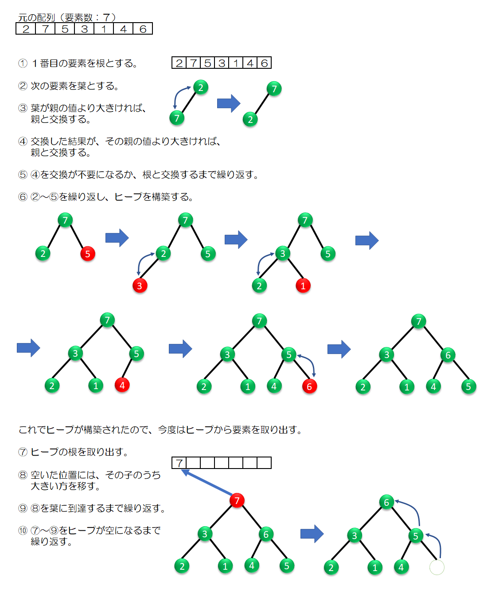

# ヒープソート

ヒープソートは、ヒープを経由する整列アルゴリズムです。  

ヒープは「小さい山」という意味の言葉であり、親の値が必ず子の値以上であることを保つ二分木です。  

1. 要素の並びを元にして、ヒープを構築します。子の処理には、木構造アルゴリズムの一種である、ヒープ構築アルゴリズムを用います。
2. 根に当たる要素を取り出して、並びの端へ移します。
3. ヒープに残った要素に対して、ヒープ再構築アルゴリズムを適用します。
4. 2と3をヒープの要素がなくなるまで繰り返します。

  

## 計算量

```text
O(n log2n)
```

## 特徴

- アルゴリズムが少し複雑。
- ヒープ木の理解が必要。
- 非常に高速。

## 参考文献

- <https://basics.k-labo.work/2017/10/03/>
