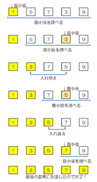

# 選択ソート

選択ソートは、最小値の要素を選択して、先頭の要素と置き換える整列アルゴリズムで、基本選択法ともいいます。  
処理効率は、バブルソートと変わらず、計算量はO(n^2)となります。  

  

## 計算量

```text
O(n^2)
```

## 特徴

- アルゴリズムがシンプル。
- 計算量が大きい。

## 参考文献

- <https://basics.k-labo.work/2017/10/03/>
