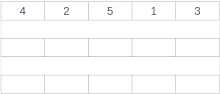

# ストランドソート

ストランドソートは、リストの項目を昇順に並べ替える再帰的な並べ替えアルゴリズムです。  
入力リストが逆ソートされたときに発生する最悪の時間複雑度はO(n^2)です。  

入力が既にソートされているリストである場合に発生するO(n)の最良のケースの時間計算量があります。  

  

## 計算量

```text
O(n^2)
```

## 特徴

- アルゴリズムが複雑。
- パフォーマンスが不安定。

## 参考文献

- <https://en.wikipedia.org/wiki/Strand_sort>
