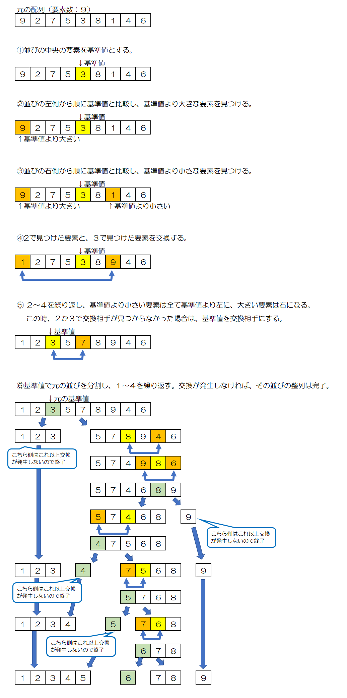

# クイックソート

クイックソートはその名の通り、特に高速な整列アルゴリズムです。  

1. 適当な基準値を定めて、その値より小さい要素を前の方に移し、その値以上の要素を後の方へ移す。  
2. 分割したそれぞれのグループへ、1の処理を反復して、全てのグループに属する要素数が1になるまで繰り返す。  

  

## 計算量

```text
O(n log2n)
```

## 特徴

- アルゴリズムが少し複雑。
- 再帰関数を使用する。
- 非常に高速。

## 参考文献

- <https://basics.k-labo.work/2017/10/03/>
