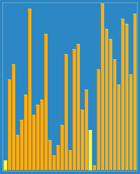

# ストゥージソート

ストゥージソートは、再帰を用いたソートアルゴリズムのひとつである。  

計算時間はO(nlog 3 / log 1.5 ) = O(n2.7095...)であり、これはマージソートなどの効率的なアルゴリズムよりも、それどころか非常に効率の悪い単純なソートの例としてよく挙げられるバブルソートよりも遅い。  

1. もし末尾の値が先頭の値より小さければ、それらを入れ替える。
2. 現在処理している部分列の要素数が3以上であれば、  
リストの先頭2/3[1]に対してストゥージソートを行う。  
リストの末尾2/3[1]に対してストゥージソートを行う。  
リストの先頭2/3[1]に対して再びストゥージソートを行う。
3. そうでなければ終了。

  

## 計算量

```text
O(n2.7095...)
```

## 特徴

- 計算量が多い。
- アルゴリズムが複雑。

## 参考文献

- <https://ja.wikipedia.org/wiki/ストゥージソート>
